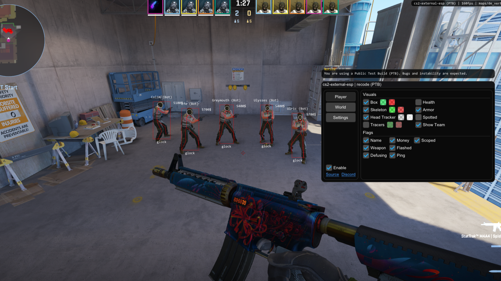

# 🎯 SourceSight

External ESP overlay for Counter-Strike 2, built for **Omarchy Linux** (Hyprland) with a modern, clean codebase. Read-only overlay — no injection, no memory writes.

> **Omarchy Linux port:** Linux platform support is under active development on the `omarchy-port` branch. The platform, renderer, and build layers are present; Linux-specific CS2 signatures still require validation against the current native game build before gameplay use.

## 🖥️ Omarchy Linux

SourceSight targets Omarchy's Hyprland session through GLFW's X11 backend (XWayland), OpenGL 3, and Linux `process_vm_readv`. It does not inject a library or write into the game process.

```bash
git clone --recursive -b omarchy-port https://github.com/jonahchang207/sourcesight-linux.git
cd sourcesight-linux
chmod +x scripts/install-omarchy.sh
./scripts/install-omarchy.sh
```

Use CS2's fullscreen-windowed mode. Press `Insert` to toggle the menu and `End` to save and exit. On Linux the overlay is click-through while playing (clicks and keys always reach the game). While the menu is open the overlay captures *all* clicks, so nothing falls through to CS2: the menu, its color picker popups, and the draggable panels (radar, spectator list) are all fully mouse-usable, and keyboard navigation (arrow keys/Tab and Space/Enter) also works. One caveat: while alive in a round CS2 grabs the mouse, so clicks also reach CS2 and may fire your weapon — configure mid-round with the keyboard, or when dead/spectating with the mouse. Note that right `Shift` is intentionally *not* a toggle key on Linux: the overlay never steals keys, so right Shift also reaches CS2, where it is the walk key — toggling on it would close the menu every time you walk. If Linux denies memory reads, do not run the overlay as root; launch it as the same user/session as Steam and inspect your distribution's `kernel.yama.ptrace_scope` policy.

## 🎬 Showcase

[](https://youtu.be/3WHHLUyHyzA)

## ✨ Features

- External, read-only ESP: box, skeleton, head tracker, health, armor, name, money, weapon, ammo, ping, and team/enemy flags
- Bomb ESP, radar, spectator list, and velocity graph
- AWP quickswitch macro: with the AWP equipped, left-click automatically taps `3` (knife), waits the configured delay, then taps `1` to cancel the bolt animation
- Bullet tracers: when a player fires, a line is drawn from the gun tip to the impact point (first player hit), kept visible for 5 seconds, and only rendered while the shooter is in your line of sight (own shots and enemies, team colors, configurable length/duration/thickness)
- Automatic offset scanning to stay compatible through game updates
- Click-based UI (Dear ImGui) with streamproof and watermark options
- Builds on Windows (Visual Studio) and Linux (CMake)

## ⚠️ Important

> This project is provided *'as is'* for learning purposes with no warranties or responsibility from the developer. Use it at your own risk; you are the only one accountable for your actions.

- **Detection Status:** This project is intended solely for single-player use. That said, no ban reports have been raised for other modes.
- **Anti-Virus Alerts:** This software may resemble malware in behavior because it accesses other processes' memory, so it is commonly flagged by anti-virus programs. Read the source code and build it yourself — all binaries are compiled via the [GitHub workflows](.github/workflows/) from this repository's source.

## 🎯 Aim & kernel mouse driver

The `aim` feature moves the real cursor toward a target screen point through a
kernel-level virtual mouse (`/dev/person-mouse`), vendored from the
CS2AiAimbot/Nod project (driver interface kept byte-identical). It injects
relative input at the kernel input-subsystem level, bypassing the compositor,
so it works under Wayland and in pointer-locked games that grab raw input.

### Install the driver (once)

```bash
sudo ./drivers/install.sh   # builds person_mouse.ko, installs udev rules, loads it
# log out and back in so your user receives the person-mouse group
```

The device accepts `dx dy` (relative movement, bounded to ±8192) and `click`
(left button). Without it, aiming is unavailable and the rest of SourceSight
works normally.

### Movement algorithms

The aim controller (`src/core/input/MouseAim.cpp`) drives the kernel mouse
with one of four configurable, frame-rate-independent algorithms:

| algorithm      | behaviour |
| --- | --- |
| `snap` | one exact correction to the target (clamped per tick) |
| `proportional` | first-order: move a fraction of the remaining error each tick (`gain`, 1/s) |
| `exponential` | dt-independent EMA of the target (`smooth`, 1/s) — monotonic, no overshoot |
| `damped` (default) | critically damped spring (`omega`, rad/s) — zero overshoot with natural ease-in/out |

All algorithms share: a per-axis deadzone, a pixel-per-second **aim speed**
cap (`speed`) plus a hard per-tick ceiling (`max_delta`), and an FOV ring —
targets farther than `fov_radius` from the cursor/crosshair are ignored. The
lock is **vision-aware**: it prefers targets in line of sight (occlusion is
tested against other players' bodies), and the pursued head is drawn on the
overlay **magenta when visible, cyan when hidden**. The cursor position is
tracked locally from the deltas sent and only re-queried from Hyprland ~4x/s,
instead of spawning `hyprctl` for every correction. `game_mode` switches the
reference point from the desktop cursor to the screen centre for
pointer-locked games (the crosshair). MB5 (side button) toggles the aim
on/off mid-game without opening the menu (`hotkey`).

Targets are fed with `MouseAim::SetTarget(x, y)`. With `aim_at_enemies`
enabled, the controller auto-selects the nearest alive enemy inside the FOV
ring by reading the player's **head bone position from memory** and projecting
it to screen coordinates through the view matrix — no capture backend
required. A **magenta scanner** (`grim` capture + blob detection) can instead
aim at the nearest pink-coloured region in the FOV ring, e.g. CS2
colorblind-assist magenta outlines; it takes over target selection while
enabled. The FOV ring itself scales from a single point to the full monitor.
The Aim tab shows a live driver status line (green when `/dev/person-mouse`
is ready, red with the install command when it is not), so a missing driver
is impossible to miss.

### Config (`config.json` → `aim`)

```jsonc
"aim": {
    "enabled": false,        // master switch — nothing moves while false
    "game_mode": false,      // true: reference the screen centre (CS2 pointer lock)
    "aim_at_enemies": true,  // auto-pick nearest enemy inside FOV from ESP data
    "algorithm": "damped",  // snap | proportional | exponential | damped
    "deadzone": 3.0,         // per-axis jitter threshold (px)
    "gain": 6.0,             // proportional rate (1/s)
    "smooth": 8.0,           // exponential EMA rate (1/s)
    "omega": 12.0,           // damped spring frequency (rad/s)
    "max_delta": 500.0,      // max correction per tick (px)
    "fov_radius": 400.0      // ignore targets beyond this radius (px)
}
```

> Aiming generates real mouse movement. Keep `enabled` off unless you are in
> an environment where input automation is allowed.

## 🛠️ Developer Instructions

### Setting up on a new computer (Linux)

**Prerequisites** — a C++20 compiler, CMake ≥ 3.24, and the dev libraries below:

```bash
# Arch / Omarchy
sudo pacman -S --needed base-devel cmake curl glfw-x11 libx11 libxrandr mesa ttf-dejavu linux-headers

# Debian / Ubuntu
sudo apt install build-essential cmake libcurl4-openssl-dev libgl1-mesa-dev \
    libglfw3-dev libx11-dev libxrandr-dev libxtst-dev
```

**Clone and build:**

```bash
git clone --recursive -b omarchy-port https://github.com/jonahchang207/sourcesight-linux
cd sourcesight-linux
cmake -S . -B build -DCMAKE_BUILD_TYPE=Release
cmake --build build --parallel
```

**Run it:**

1. Start CS2 and switch to **fullscreen-windowed** mode (the overlay does not
   render over true fullscreen).
2. From the repo root, run `./build/sourcesight` — the binary looks for
   `config.json` and the `maps/` folder next to itself, so either copy them
   into `build/` or run from the repo root. `config.json` is user-specific
   and gitignored; the overlay runs with defaults if it is missing.
3. `Insert` toggles the menu, `End` saves and exits. Linux is click-through
   while playing, so right `Shift` is intentionally not a toggle key (it
   reaches CS2 and would walk-close the menu).

**Optional — aimbot kernel mouse:** the `aim` feature needs the vendored
kernel driver (installed once per machine):

```bash
sudo ./drivers/install.sh   # builds person_mouse.ko, installs udev rules, loads it
# log out and back in so your user joins the person-mouse group
```

**When CS2 patches:** the global signatures (entity list, view matrix, …) are
re-scanned automatically at startup, but the hardcoded member offsets in
`src/core/offsets/Offsets.hpp` (`m_hPawn`, `m_iHealth`, `m_iTeamNum`, …) can
shift with any game update. Refresh them against a fresh schema dump
(`sezzyaep/CS2-OFFSETS` or `a2x/cs2-dumper`). If players stop resolving, or
resolve but read as dead (health 0), the offsets are stale — the one-shot
`[player] diag:` / `[weapon] diag:` logs in `Player.cpp` / `Weapon.cpp` name
the exact failing stage.

### Windows

1. Clone the repository with submodules: `git clone --recursive -b omarchy-port https://github.com/jonahchang207/sourcesight-linux`
   - If you cloned before submodules were added, run `git submodule update --init --recursive`
2. Build using **Visual Studio 2022** (or later): Build **`x64 - Release`**
3. Locate your binary in `<arch>/<configuration>`, e.g. `x64/Release`.

## 🔖 License & Copyright

© 2026 **Jonah Chang**. All rights reserved. See the [LICENSE](LICENSE) file for details.
