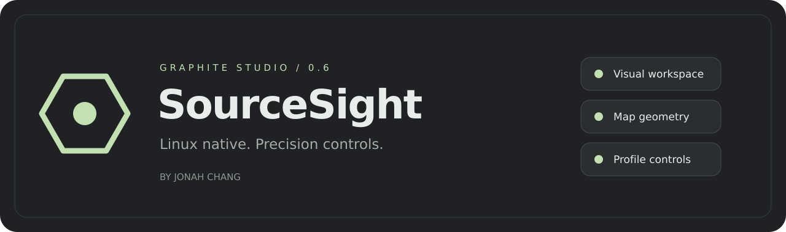
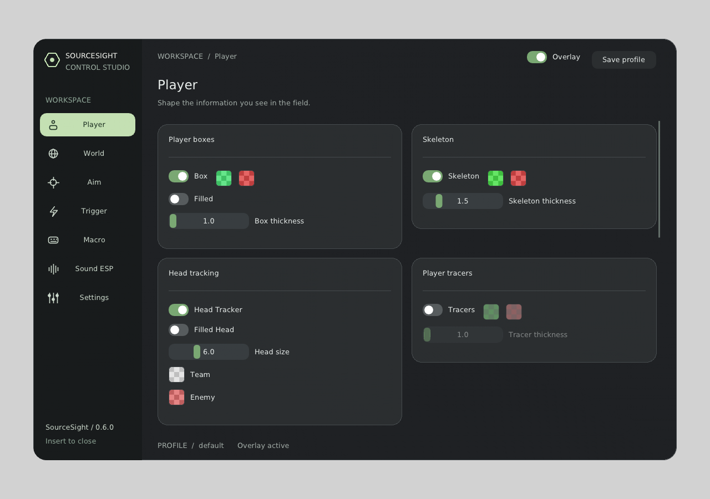

<div align="center">



**A Linux-native CS2 overlay with a graphite control workspace.**

[Download v0.6.0](https://github.com/jonahchang207/sourcesight-linux/releases/tag/v0.6.0) ·
[Release notes](RELEASE_NOTES_v0.6.0.md) · [License](LICENSE)

</div>

## Graphite Studio

SourceSight combines a native Dear ImGui interface with player/world overlays,
map collision visualization, input controls and saved profiles.
Maintained by **Jonah Chang**.



### Current source features

The published v0.6.0 download predates some features below. See
[CHANGELOG.md](CHANGELOG.md) for unreleased changes; a local build is required
to use them until the maintainer publishes a new release.

- Rebuilt menu with aperture branding, distinct icons, padded cards, switches
  and a persistent profile/save area.
- **World → Map geometry:** wireframe opacity, color, detail and distance.
- **Player → Player wireframe (source builds after v0.6.0):** contoured bone-driven bodies with a shaped torso/head, tapered limbs, hands and feet. Standard / Detailed / Ultra use 8 / 12 / 16 sides and 3 / 5 / 7 rings per part; Detailed is the default. Distant players automatically use fewer subdivisions. Visible (sage), blocked (coral), and unknown (gray) colors share the world's collision data even when world lines are hidden. Includes visible-only filtering, opacity, thickness, color and distance controls. Missing map data is never treated as visible. This approximates the body, not the game's character mesh; visibility samples small surface cells against static collision, not smoke, doors, moving props or other players.
  Lower detail reduces the maximum number of edges drawn per frame.
- Map rendering caches triangle bounds at load time, uses support-vertex frustum rejection and batches anti-aliased lines. Camera projection still updates every frame.
- **World → Map geometry → Full map:** uploads the complete collision mesh to the render GPU. A depth-only pass selects the nearest surfaces, followed by graphite panels at **10% opacity by default**, independently colored wire edges, and the SourceSight UI. Rear panels never accumulate opacity; optional **X-ray lines** affects edges only. **Panel fill** controls surface opacity (0–35%). The legacy opaque “Hide real map surfaces” setting is ignored, including in saved profiles. This external overlay cannot selectively remove CS2 buildings/ground while preserving its native weapon and HUD; it does not disable the game's renderer.
- **World → Radar:** Match CS2 minimap and Apply CS2 zoom are enabled by default. Set CS2 radar zoom to match `cl_radar_scale` (default `0.70`), HUD scaling to match `hud_scaling`, and Radar HUD size to match `cl_hud_radar_scale`. With the menu open, align the guide circle and cross with the game radar using Position, Base size, and Offset. Then adjust Calibrated range until teammate markers line up; decrease range if markers cluster too close to the center. Range is calibrated at zoom `0.70`; higher zoom increases marker separation. Recalibrate after changing maps: collision-mesh bounds cannot determine overview scale. Use centered radar with dynamic zoom disabled and match the rotation setting. Use current resolution records the game-window height; saved calibration then scales uniformly with viewport height. Save the profile to keep the calibration.
- **Player → Bullet trails:** Ion glow, Streak and Minimal styles with fading cores and optional impact markers. Each estimated shot stops at the nearest static-map triangle or bone-based player capsule (including teammates); missing bones use a conservative hull. Local shots are included, and detection/rendering run once per frame. A muzzle guard prevents long cosmetic offsets from skipping nearby obstacles. New trails pause while matching map geometry is unavailable. These are ammo/aim-based estimates, not server bullet-impact events: spread, recoil correction, penetration, ricochets and dynamic props are not simulated. Existing profiles retain their trace-distance setting; raise **Trace distance** if trails end before reaching distant surfaces.
- Background geometry loading, automatic retries, immutable mesh snapshots,
  file validation, spatial culling and camera-plane/screen-edge clipping.
- Transparent graphite overlay surfaces and adjustable radar opacity.
- SkinChanger removed from the implementation, menu and configuration.

## Download and run

Download `sourcesight-v0.6.0-linux-x86_64.tar.gz` and its checksum from the
[release page](https://github.com/jonahchang207/sourcesight-linux/releases/tag/v0.6.0).
Extract it, open a terminal inside the extracted directory, then run:

```sh
./sourcesight
```

The binary is built on Arch Linux x86-64 and dynamically links system libraries.
It requires **glibc 2.43+**, compatible libstdc++, GLFW 3.4+, libcurl, OpenGL and
X11/Xext/Xi/Xtst. It is not a universal Linux binary; older distributions may
need an unmodified local build.

Use a windowed/borderless CS2 mode supported by your compositor. Process access
permissions depend on your setup. The repository's `drivers/` directory contains
the separate GPL-2.0 input driver; no precompiled kernel module is shipped.

No anti-cheat compatibility or account-safety guarantee is made.
SourceSight is not affiliated with Valve.

## Controls and settings

| Tab | Controls |
| --- | --- |
| Player | Boxes, skeletons, head tracking, tracers, health and player information |
| World | Bomb, spectators, crosshair, radar, velocity and map wireframe |
| Aim | Target selection, FOV, smoothing, weapon multipliers and input settings |
| Trigger | Activation, timing, bursts and weapon filters |
| Macro | Quick-switch settings |
| Sound ESP | Footsteps, gunshots, colors, distance and fade |
| Settings | Profiles and application preferences |

**Insert** opens the menu. **F9** is the panic key when enabled.
**MB5 / F10** toggle aim. **End** saves and exits.
Profiles live in `configs/` under the working directory. Use **Save profile**
to persist changes. Releases contain no personal profiles, logs or credentials.

### Product-quality improvements (source builds)

- Shared graphite design tokens, section/option-alias search, and confirmed
  Conservative / Balanced / Detail visual presets. Presets do not enable features
  or automation. Mode-inapplicable map controls are disabled.
- **Settings → Diagnostics** shows cache state/freshness, profile errors, and
  measured render-thread CPU time. GPU timing is explicitly unavailable.
  Diagnostic export is user-invoked, excludes identifying/game data, and refuses
  to overwrite an existing file. It does not upload anything.
- Profiles have an explicit schema, validation before application, same-directory
  atomic writes, and a previous-good `<profile>.json.bak` backup. Malformed or
  future-version profiles are rejected without partially applying their values.
  To recover manually, close the app, retain the damaged file separately, and
  copy a known-good backup to its original `.json` name.
- Stale snapshots stop world/player drawing; missing-local spectator frames are
  kept separate from local-input readiness. Normal shutdown joins the engine
  worker and drains the outstanding map task before logger teardown.

Offline menu preview, without attaching to CS2 or enabling profile/capture/export
actions (run after building; requires EGL libraries as well as normal build dependencies):

```sh
node tools/preview-menu.mjs
LIBGL_ALWAYS_SOFTWARE=1 node tools/preview-menu.mjs --headless --width 940 --height 600 --screenshot /tmp/sourcesight-menu.ppm
```

The preview uses empty-state data, not a live match or a full game simulator.

## Map geometry

Place compatible raw triangle files in `maps/<map-name>.tri` beside the executable.
For example: `maps/de_dust2.tri`. Each triangle is three little-endian XYZ float
vectors, 36 bytes total, with no header.

SourceSight searches the configured directory, beside the executable and one
directory above it for source-tree builds. Missing maps retry every 30 seconds.
The World card reports loaded geometry and its triangle count.

Game-derived map assets are not included in the binary release and are not
covered by SourceSight's license. Obtain compatible data from your installation
using appropriate tools and permissions. Automatic extraction is best-effort;
compressed resources may require Source 2 Viewer or another compatible extractor.

## Build an unmodified copy

Requires CMake 3.24+, C++20 with `std::format`, and the libraries above.
On Arch Linux:

```sh
sudo pacman -S --needed base-devel cmake git curl glfw-x11 libx11 libxext libxi libxtst mesa ttf-dejavu
git clone --recurse-submodules https://github.com/jonahchang207/sourcesight-linux.git
cd sourcesight-linux
cmake -S . -B build -DCMAKE_BUILD_TYPE=Release
cmake --build build --parallel 2
./build/sourcesight
```

To run geometry regressions, install Node.js and execute:

```sh
node tools/test-map-geometry.mjs
```

Run all product-quality checks after a build with
`LIBGL_ALWAYS_SOFTWARE=1 node tools/check.mjs`. This includes config/recovery,
cache lifecycle, menu interactions, geometry, OpenGL pixels and packaging checks.
CI runs these before uploading build/release artifacts. See
[the release and rollback procedure](docs/RELEASING.md) and
[reusable Luna/Terra prompts](docs/agent-prompts/README.md).

Tests cover clipping, visibility, invalid files, cancellation, concurrent mesh
snapshots, zero opacity and detail budgets, without launching CS2.

For full-map rendering regressions, with EGL headers/libraries and surfaceless
OpenGL support (such as Mesa), run `node tools/test-full-map-renderer.mjs`.
This reads actual framebuffer pixels to verify graphite fill opacity, overlapping
panels, hidden versus X-ray edges, camera movement, UI compositing, GL state
restoration, and migration of the old opaque setting. It does not launch CS2.

## Current limits

- The radar remains a separate overlay. Exact dot alignment with the built-in
  CS2 minimap is **not implemented** in this release.
- Wireframes follow the current view matrix; FOV behavior is unchanged.
  Dense scenes may omit farther edges when the detail budget is exhausted.
- Meshes represent static collision, not smoke or every dynamic object.
- Compilation and standalone ImGui/geometry checks passed locally.
  Live in-game alignment/rendering has not been verified for this release.
- Automatic reattachment after the CS2 process exits is not implemented. Restart
  the app after restarting the game. Shutdown may wait for an in-flight map task.
- The diagnostics timing is for the render thread, not total process CPU usage;
  per-pass GPU profiling and a full synthetic match preview remain future work.

## License and development

Original SourceSight material is **proprietary, source-visible software**,
not MIT/open-source software. Unmodified personal, noncommercial use and local
compilation are permitted. Selling, redistribution, modifications, mods and
derivative products require Jonah Chang's written permission.

Third-party licenses, the separate driver, earlier valid license grants and
GitHub's public-repository permissions are exceptions.
Read [LICENSE](LICENSE), [third-party notices](THIRD_PARTY_NOTICES.md), and the
[maintainer-only development policy](CONTRIBUTING.md).
